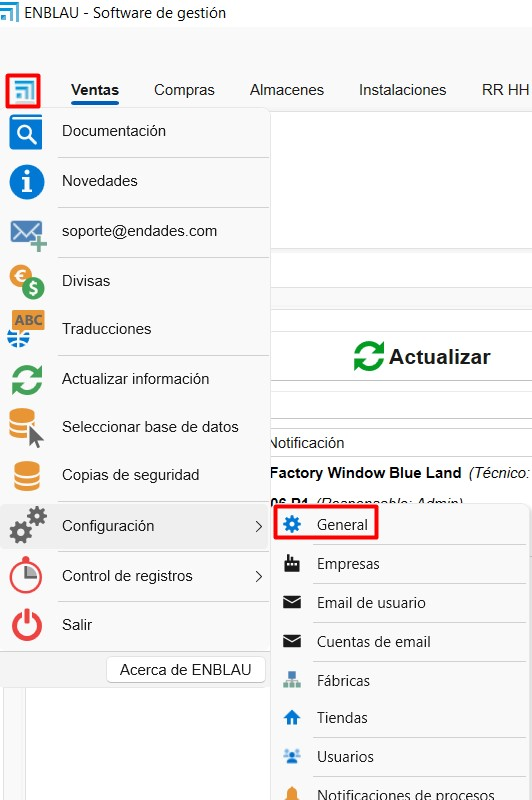

# Posibles errores

## 1. Errores y soluciones

### 1.1. Error de conexión al servidor y base de datos

- **Descripción del error:**  
  Al intentar seleccionar la base de datos en **ENBLAU**, aparece un mensaje de error cuando no se encuentra el servidor o la instancia.  
  Este problema puede deberse a bloqueos por parte del **antivirus** o **firewall** en el servidor donde se ejecuta ENBLAU.

  

- **Solución:**  
  Revisar las reglas y excepciones del antivirus o firewall en el servidor.  
  Para más detalles, consulta la sección **2. Ajustes del antivirus y firewall** en la guía de [Configuración del Sistema](Configuracion_Sistema.md).

---

### 1.2. Error de conexión a fábrica

- **Descripción del error:**  
  Al intentar conectarse a fábrica, aparece un error indicando que la ruta de ejecución para conectar con **Logikal** no está definida correctamente.

  

- **Solución:**  
  Verifica que la ruta de la aplicación **Logikal** sea la correcta.  
  En ENBLAU, dirígete a:  
  **General → Logikal - Conexión y Proyectos**.

    
  

---

### 1.3. Error de interfaz con ERP

- **Descripción del error:**  
  Al intentar conectarse a fábrica, se muestra un error indicando que no se encuentra una licencia válida para la **interfaz ERP** de Logikal.

  

- **Solución:**  
  Para establecer la conexión con fábrica, es necesario tener instalado el **módulo ERP de Logikal**.  
  Contacta con **Orgadata** para gestionar la licencia:

  - Email: [customer.support@orgadata.com](mailto:customer.support@orgadata.com)  
  - Llama al técnico responsable de soporte de Logikal

---
