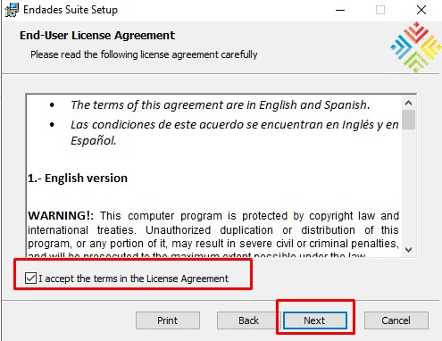

# Requisitos entorno ENBLAU

## 1. Requisistos para la configuracion de la app ENBLAU 

Para proceder con la instalación y configuración de ENBLAU hay que hacer algunas configuraciones previas en el entorno que se va a instalar la app.

---

### 1.1 Antivirus y Firewall

> Seguir las recomendaciones en el apartado del **2. Ajustes del antivirus y firewall** en [Configuración del Sistema](Configuracion_Sistema.md).

---

## 2. Instalación de ENBLAU

1. Instalar ENBLAU con el **`Setup Enblau.msi`** proporcionado por ENDADES. Ejecuta el archivo haciendo doble clic.

    

2. Al confirmar la instalación, se abrirá la ventana del **Endades Suite Setup**. Sigue los pasos a continuación:

     

   - Acepta los términos de la licencia marcando la casilla correspondiente y continúa.

     

   - Indicar la ruta de donde quiere que se haga la instalación de ENBLAU.

     

   - Haz clic en **"Instalar"** para comenzar.

      

   - Finaliza la instalación.

     
    

---

## 3. Instalación y creación de instancia SQL Server

Es necesario instalar SQL Server para poder crear la instancia del servidor. Hay dos maneras de hacerlo, ejecutando un fichero .bat que se encuentra en la ruta de instalación de ENBLAU o hacerlo de forma manual.

### 3.1. Ejecutando .bat

1. Acceder desde windows explorer a la ruta ejemplo: **`C:\ENBLAU\Datos`** de instalación de ENBLAU donde se encuentra el fichero **00 - InstalaciónSQL.bat**.

     

2. Ejecutar el fichero **00 - InstalaciónSQL.bat** (asegurarse que tienes permiso de administrador en el entorno que se está ejecutando). Al ejecutarlo se instalará **SQL Server 2022** y creará la instancia **ENDADES2022**.

     

     

     

3. Comprueba si se ha instalado y creado correctamente la instancia desde **Sql Server Configuration Manager**:

     

### 3.2. Instalación manual 

1. Acceder desde windows explorer a la ruta ejemplo: **`C:\ENBLAU\Datos`** de instalación de ENBLAU donde se encuentra el ejecutable **SQLEXPR_x64_ENU.exe**.

     

2. Ejecutar el el fichero .exe.

---

