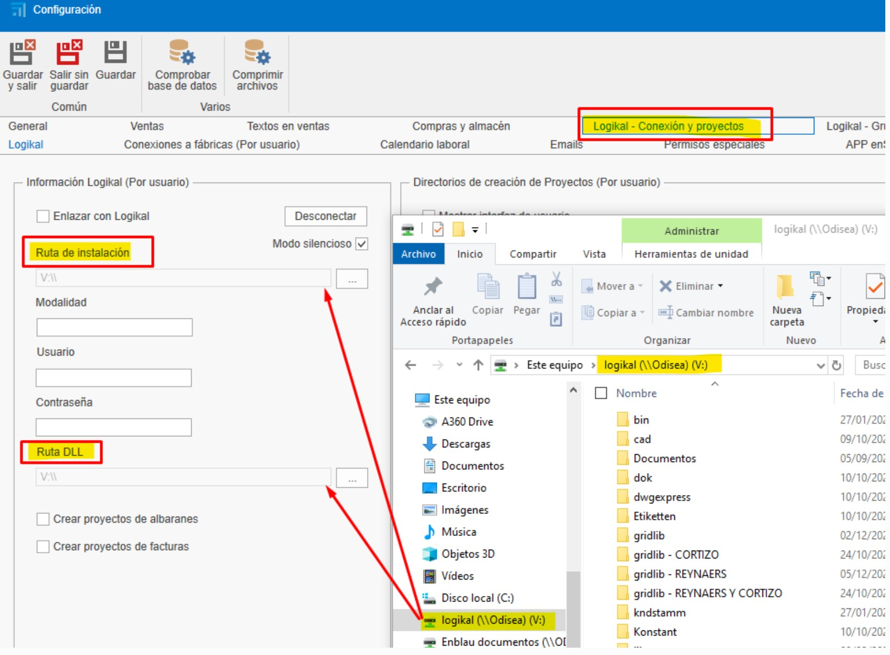

# Possible Errors

## 1. Errors and Solutions

### 1.1. Server and Database Connection Error

**Error Description:**  
  When trying to select the database in **ENBLAU**, an error message appears if the server or instance cannot be found.  
  This issue may be caused by blocks from the **antivirus** or **firewall** on the server where ENBLAU is running.

  

**Solution:**  
  Review the antivirus or firewall rules and exceptions on the server. Example:

  1. From Firewall → Advanced Settings → **Inbound Rules**, verify that ports **1433 TCP** (standard SQL Server port) and **1434 UDP** (for instance discovery) are enabled:

  

  2. From **SQL Server Configuration Manager**, verify that the **ENDADES2022** instance has TCP/IP enabled:

  

  > ℹ️ **Note:** For more details, see section **2. Antivirus and Firewall Settings** in the [System Configuration](Configuracion_Sistema.md) guide.

  Once checked, open **enCONNECT** and select the server and database.

---

### 1.2. Factory Connection Error

**Error Description:**  
  When trying to connect to the factory, an error appears indicating that the execution path to connect with **Logikal** is not defined correctly.

  

**Solution:**  
  Verify that the **Logikal** application path is correct.
    
  - In ENBLAU, go to:  
    **General → Logikal - Connection and Projects**.

  

  

---

### 1.3. ERP Interface Error

**Error Description:**  
  When trying to connect to the factory, an error appears indicating that no valid license was found for the **Logikal ERP interface**.

  

**Solution:**  
  To establish a connection with the factory, the **Logikal ERP module** must be installed.  
  Contact **Orgadata** to manage the license:

  - Email: [customer.support@orgadata.com](mailto:customer.support@orgadata.com)  
  - Call the Logikal support technician.

---

### 1.4. Logikal factory access error

**Error description:**  
  When attempting to connect to the factory (Logikal), an access error is displayed on the folder path where Logikal is being executed.

  

**Solution:**  
  To establish the connection with the factory, the folder must be set as trusted. To do this, in Windows go to **Network and Internet > Internet Options**:

  

  Then, in **Internet Properties**, go to the **Security > Local intranet > Sites > Advanced** tab and add these 2 websites **file://server** and **server**.

  

---

### 1.5. Server connection error from enSITE

- **Error Description:**  
  When trying to connect to the server from the **enSITE** (tablet) application, an error message appears related to the SQL Server connection.

  

  

---

**Solution:**

  1. **Check the network:**  
    Make sure the tablet is connected to the **same local network** as the server hosting the database.

  2. **Check the firewall and antivirus:**  
    Ensure the **firewall** and/or **antivirus** are not blocking the connection between the device and SQL Server.  
    Add rules or exceptions if necessary.

  3. **Check port configuration:**  
    On the server, make sure the **SQL Server ports are enabled**, including:
    - **1433/TCP** (standard SQL Server port). Verify and configure in **SQL Server Configuration Manager**:  
        - Go to **SQL Server Network Configuration → Protocols for ENDADES2022**.  
        - In **TCP/IP Properties → IP Addresses**, ensure that **all IPs** have the **TCP Port** set to **1433** and the **TCP Dynamic Port** set to **0**.

          

      - **1434 UDP** (for instance discovery)
      <!-- - Other custom ports that may be used by enSITE, for example: **TCP-57073** -->

---

> ℹ️**Note:** This error is common when there are network or security configuration conflicts. Checking all the points above usually resolves the issue.

---

### 1.6. File error

- **Error description:**  
  This error occurs when Windows occasionally corrupts certain files. It may be related to the operating system configuration.

  

---

**Solution:**

  1. **Delete the folder:**  
     By deleting the folder indicated in the path shown by the error, the issue is resolved.

     - Close ENBLAU.
     - Delete the folder `C:\Users\User_name\AppData\Local\Endades`
     - Open ENBLAU.

---

> ⚠️ **Important:** It is mandatory to use at least **SQL Server 2022** to ensure compatibility with ENBLAU and enSITE versions.
