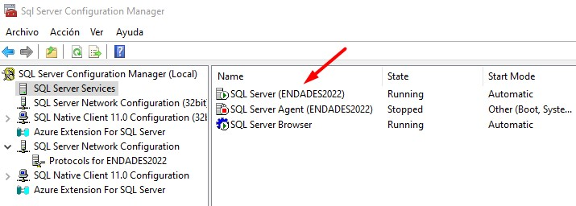
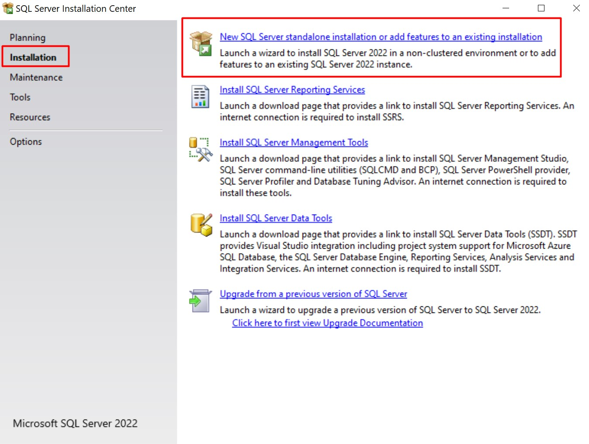
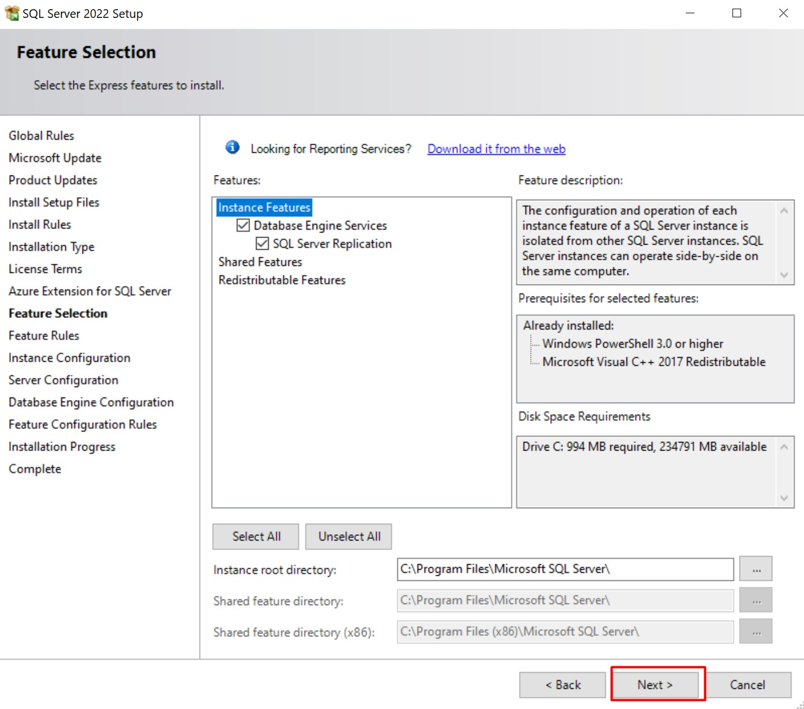
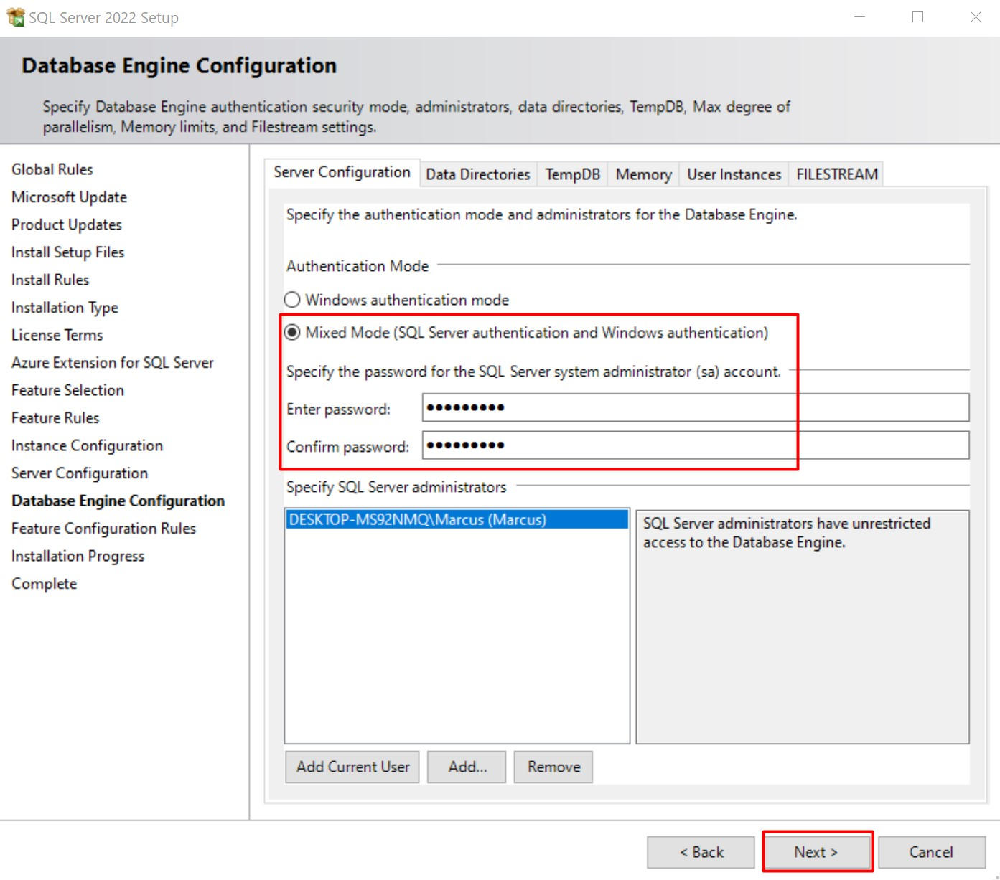
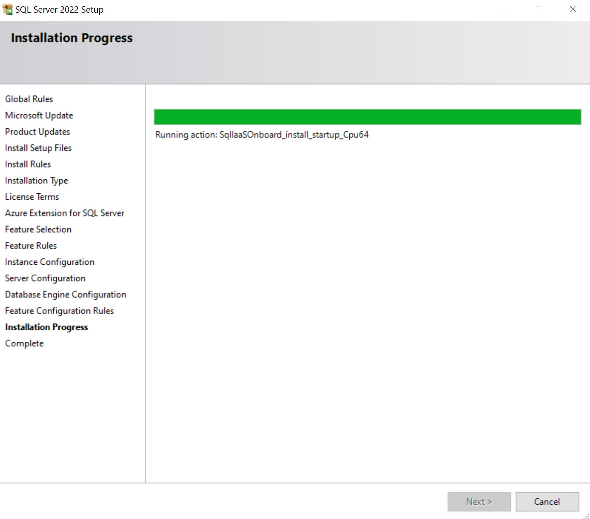
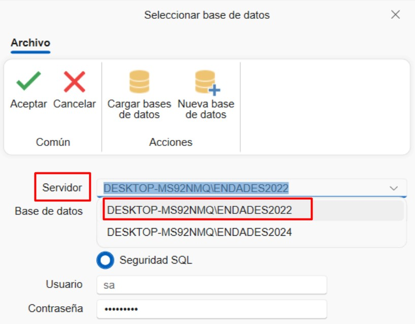

# ENBLAU Environment Requirements

## 1. Requirements for ENBLAU App Configuration

Before proceeding with the installation and configuration of ENBLAU, it is necessary to perform some preliminary settings in the environment where the application will be installed.

---

### 1.1. Antivirus and Firewall

> Follow the recommendations in section **2. Antivirus and Firewall Settings** of [System Configuration](Configuracion_Sistema.md).

---

## 2. ENBLAU Installation

1. Run the **`Setup Enblau.msi`** installer provided by ENDADES with a double click.

   

2. When the installation starts, the **Endades Suite Setup** window will appear. Follow these steps:

   

   - Accept the license terms by checking the corresponding box.

     

   - Specify the path where ENBLAU will be installed.

     

   - Click **"Install"** to begin the installation.

     

   - Complete the process.

     

---

## 3. SQL Server Installation and Instance Creation

To use ENBLAU, it is necessary to install SQL Server and create an instance. This can be done automatically with a `.bat` file or manually.

### 3.1. Automatic Installation with `.bat`

1. From Windows Explorer, go to the ENBLAU installation path, for example: **`C:\ENBLAU\Datos`**, and locate the file **`00 - InstalaciónSQL.bat`**.

   

2. Run the **`00 - InstalaciónSQL.bat`** file as an administrator. This will install **SQL Server 2022** and create the **ENDADES2022** instance.

     
   

3. Verify that the instance was created correctly from **SQL Server Configuration Manager**:

   

> **Note:** If you cannot execute the `.bat` file despite having administrator permissions, it may be blocked by the antivirus or the firewall may be preventing some of the connections that the script attempts to establish. Check whether the antivirus has quarantined the file or if the firewall is restricting access to the network or specific resources.

### 3.2. Manual Installation

1. Go to the path **`C:\ENBLAU\Datos`** and locate the executable **`SQLEXPR_x64_ENU.exe`**. Alternatively, you can download it from:  
   [https://www.microsoft.com/en-us/download/details.aspx?id=104781](https://www.microsoft.com/en-us/download/details.aspx?id=104781)

   

2. Run the installer and follow the guided steps:

     
     
     
     
     
     
   

   > **Instance Name:** `ENDADES2022`

     
   

   > **`sa` user password:** `Endades$0`

     
     
   

---

## 4. SQL Server Management Studio (SSMS) Installation

It is recommended to install **SQL Server Management Studio 20** in the environment where ENBLAU and SQL Server have been installed.

1. Download the version from:  
   [https://learn.microsoft.com/en-us/ssms/release-notes-20](https://learn.microsoft.com/en-us/ssms/release-notes-20)

   

2. Follow the official installation instructions from:  
   [https://learn.microsoft.com/en-us/ssms/install/install](https://learn.microsoft.com/en-us/ssms/install/install)

---

## 5. ENBLAU Database Creation

### 5.1. Create Using `.bat`

1. Go to the ENBLAU installation path, for example: **`C:\ENBLAU\Datos`**, and locate the file **`01 - CreaciónDB.bat`**.

   

2. Run the file as administrator. It will execute the **`CreateDB.sql`** and **`Structure.sql`** scripts located in **`C:\ENBLAU\Datos\Scripts`**.

3. Once completed, a database named **Easywork** will be created in the **`server\ENDADES2022`** instance, which will be used by ENBLAU.

> **Note:** If you cannot execute the `.bat` file despite having administrator permissions, it may be blocked by the antivirus or the firewall may be preventing some of the connections that the script attempts to establish. Check whether the antivirus has quarantined the file or if the firewall is restricting access to the network or specific resources.

### 5.2. Manual Creation

1. Go to the ENBLAU installation path, for example: **`C:\ENBLAU\Datos\Scripts`**, and locate the **`CreateDB.sql`** and **`Structure.sql`** scripts.

   

2. Open **SQL Server Management Studio**, connect to the corresponding server, for example: **`server\ENDADES2022`**. Make sure to use the **sa** user and password **Endades$0**.

   

3. Open the **`CreateDB.sql`** file first and execute it.

   

4. Then repeat the same process with the **`Structure.sql`** file.

> ⚠️ **Important:** The scripts must be executed in the indicated order: first **CreateDB.sql**, then **Structure.sql**.

---

## 6. Selecting the Database in ENBLAU

1. When opening ENBLAU for the first time, you will be prompted to select a database. Click **OK**.

   

2. In the **enCONNECT** window (app that opens for **Select Database**), in the **Server** field, select the created instance, for example: **`server\ENDADES2022`**.

   

3. Click **Load Database**, expand the corresponding field and select **Easywork** from the list.

   

---

## 7. Network Drive Connection

To connect to ENBLAU from a Windows computer, it is necessary to properly configure the network drive connection.  
This step is essential for the program to function correctly.

Refer to the detailed guide in the following link:  
🔗 [Connect Network Drive](https://documentation.endades.com/en/Utilities/6.UT_Unidad_Red/)

---

> **Note:** For more information, see [Possible Errors](Posibles_Errores.md)

---

> ⚠️ **Important:** It is mandatory to use **SQL Server 2022** or higher to ensure compatibility with ENBLAU and enSITE versions.
