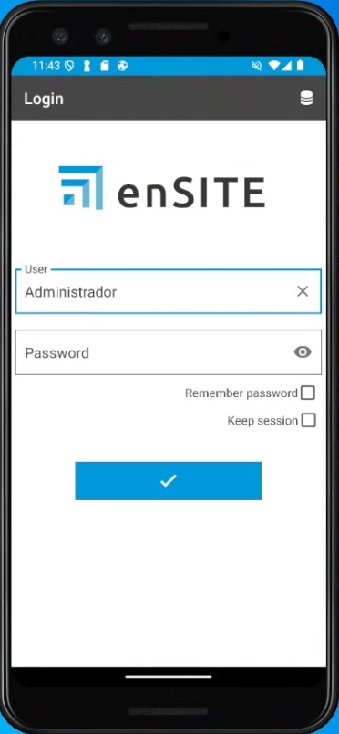

# enSITE Installation Requirements

## 1. Requirements for configuring the enSITE App

Before proceeding with the installation and configuration of enSITE, some prior configurations are required.

### 1.1. Minimum requirements

The minimum requirements to install enSITE on a mobile phone or tablet depend on the platform and are determined by the **Google Play Store on Android** and the **App Store on iOS**.

| Requirement | Android (Play Store) | iOS (App Store) |
|------------|----------------------|-----------------|
| **Minimum system version** | Android 15 (API 26); however, it is recommended to use the latest Android versions | iOS 16 (Apple requires new apps and updates to support the latest 3 versions) |
| **CPU / Architecture** | ARM 64-bit (arm64-v8a); multi-core CPU sufficient for standard apps | All recent iPhones/iPads use ARM 64-bit |
| **Minimum RAM** | 3 GB minimum | 3 GB minimum; Apple does not explicitly verify this, it depends on iOS version and model |
| **Free storage** | 200 MB minimum for installation | 200 MB minimum for installation |
| **Screen / resolution** | ≥720p recommended; compatible with different sizes (mobile and tablet) | All devices compatible with iOS 16 or later |
| **GPU / graphics** | Integrated, compatible with OpenGL ES or Vulkan | Integrated in Apple SoC; all compatible with iOS 16 |
| **Connectivity** | Wi-Fi / Mobile data; Bluetooth, GPS | Wi-Fi / Mobile data; Bluetooth, GPS |
| **Permissions / policies** | Privacy policies if data is handled; minimal permissions; Google Play compliance | Privacy policies; App Store Review Guidelines compliance; justified permissions |
| **Updates** | Depends on Google Play and declared compatibility | Apple requires compatibility with the latest versions; if your device cannot update iOS, it will not receive new versions |

> 💡 **Notes:**

1. **Android:** even if the hardware is sufficient, the app update may be blocked by Play Store filters.

2. **iOS:** the main limitation is the iOS version supported by your device. Apple automatically controls compatibility.

3. **RAM and storage:** these are practical recommendations; Google does not officially block apps based on RAM.

### 1.2. Antivirus and Firewall

> Follow the recommendations in section **2. Antivirus and firewall settings** in [System Configuration](Configuracion_Sistema.md).

---

## 2. enSITE Installation

1. From a tablet or mobile phone with a Wi-Fi connection, access the Play Store (Android) or App Store (iOS), search for enSITE, and download the app.

    

2. Open enSITE and enter the following information:

    - License code (provided by Endades)
    - Server and instance (the same where ENBLAU is installed on the server)
    - Database (the same where ENBLAU is installed on the server)
    - User – **sa**
    - Password – **Same database connection password used by ENBLAU**

    

   - Login **username** and **password** (the same ones used in ENBLAU)

    

    

---

> ℹ️ **Note:** For more information about possible errors during the server connection process from enSITE, follow this link: [Possible enSITE errors](Posibles_Errores.md/#15-error-de-conexion-al-servidor-desde-ensite)

---

> ⚠️ **Important:** It is mandatory to use at least **SQL Server 2022** to ensure compatibility with future versions of ENBLAU and enSITE.
