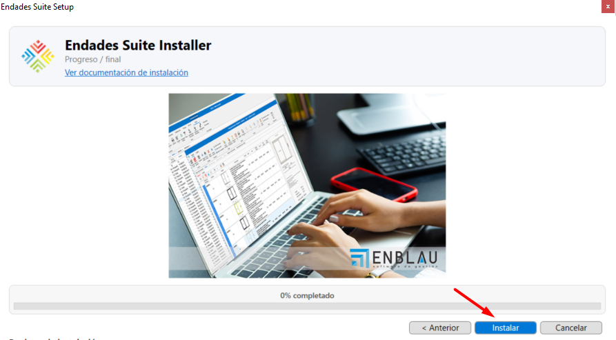

# Instalador Endades Suite

## 1. Instalación completa Endades Suite

Descarga el instalador **`Endades Suite Setup.exe`** desde la ruta proporcionada por ENDADES. Antes de proceder con la instalación, sigue las recomendaciones del apartado en [Configuración del Sistema](Configuracion_Sistema.md).

---

## 2. Ejecutar instalador

### 2.1. Iniciar la instalación
Ejecuta el archivo **`Endades Suite Setup.exe`** proporcionado por ENDADES con doble clic.

   

### 2.2. Proceso de instalación paso a paso
Al iniciar la instalación, se abrirá la ventana de **Endades Suite Installer**. Sigue estos pasos:

#### Paso 1: Acuerdo de licencia
- Acepta el acuerdo de licencia (EULA) marcando la casilla correspondiente.
- Haz clic en **Siguiente**.

   

#### Paso 2: Configuración de instalación
- Especifica la ruta donde se instalará ENBLAU.
- Introduce el nombre de la instancia de SQL.
  
  **Importante:** Por defecto aparece **`ENDADES2022`**. Si ya existe una instancia con ese nombre, la instalación mostrará las instancias ya creadas en el log de registro de instalación y no avanzará hasta que selecciones un nombre de instancia diferente.
  
- Haz clic en **Siguiente**.

   

#### Paso 3: Configuración de licencia
- Introduce el nombre de usuario y contraseña proporcionados por ENDADES.
- En el apartado **Licencias disponibles** aparecerá la licencia activa.
- Selecciona la licencia y haz clic en **Siguiente**.

   

#### Paso 4: Confirmar instalación
- Revisa la configuración seleccionada.
- Haz clic en **Instalar** para comenzar el proceso.

   

#### Paso 5: Progreso de instalación
- El sistema instalará la instancia de SQL Server y la base de datos ENBLAU.
- Este proceso puede tardar varios minutos.

   

#### Paso 6: Finalización
- Una vez completado al 100%, haz clic en **Finalizar**.

   

---

## 3. Selección de la base de datos en ENBLAU

### 3.1. Primera ejecución de ENBLAU
Al abrir ENBLAU por primera vez, se solicitará seleccionar una base de datos. Haz clic en **Aceptar**.

   

### 3.2. Configurar conexión en enCONNECT
1. En la ventana de **enCONNECT** (aplicación para gestionar conexiones):
   - En el campo **Servidor**, selecciona o escribe la instancia creada, por ejemplo: **`nombre_servidor\ENDADES2022`**.

   

2. Conecta y carga bases de datos:
   - Haz clic en **Cargar base de datos**.
   - Despliega la lista de bases de datos disponibles.
   - Selecciona por ejemplo: **ENBLAU** de la lista.

   

---

> **Nota:** Para más información sobre problemas durante la instalación, consulta [Posibles errores](Posibles_Errores.md).