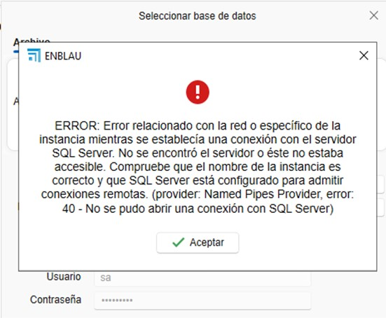
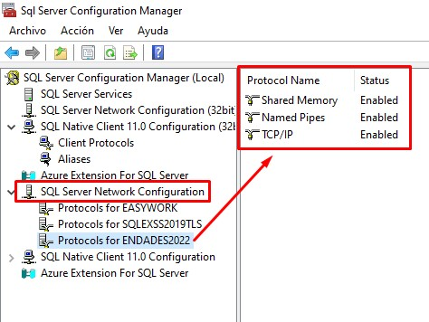
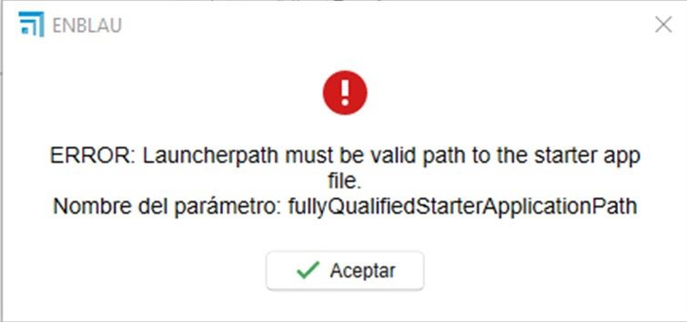
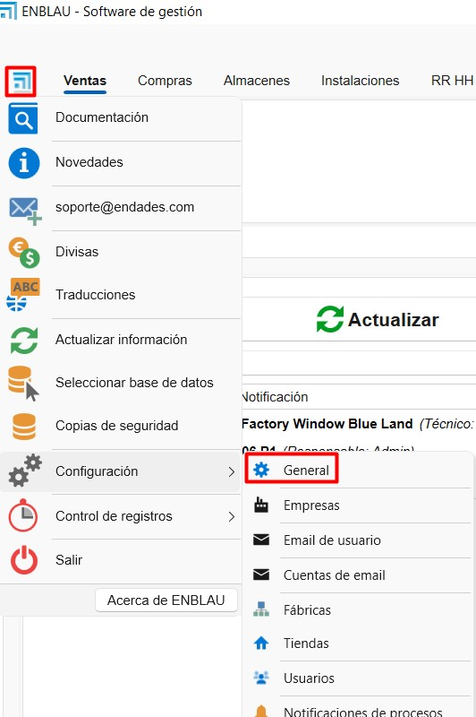
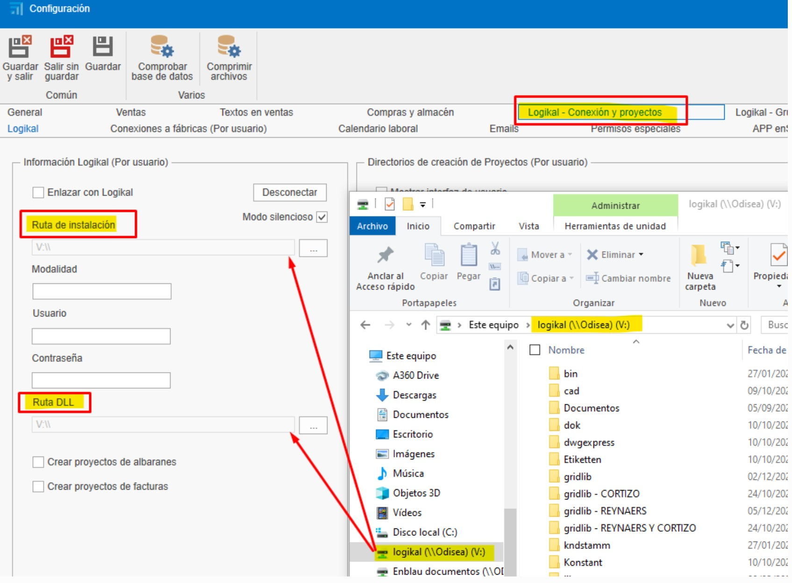
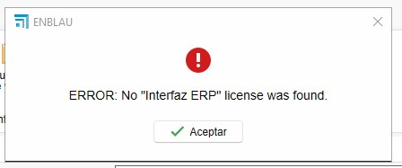
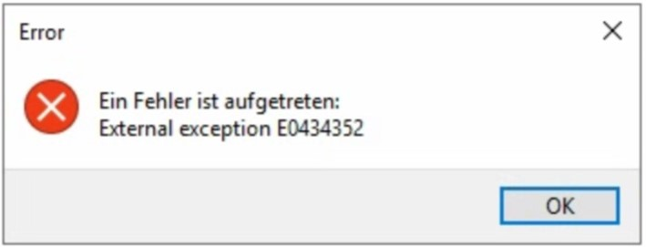
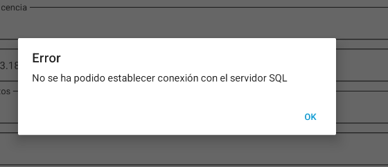
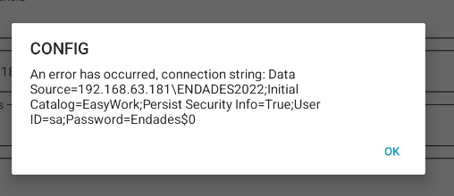
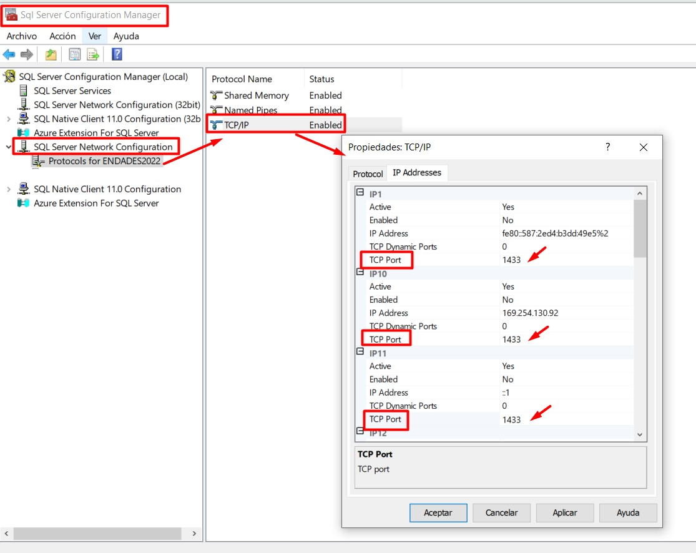

# Possibili errori

## 1. Errori e soluzioni

### 1.1. Errore di connessione al server e al database

**Descrizione dell’errore:**  
  Durante la selezione del database in **ENBLAU**, appare un messaggio di errore quando il server o l’istanza non vengono trovati.  
  Questo problema può essere causato da blocchi dell’**antivirus** o del **firewall** sul server in cui è in esecuzione ENBLAU.

  

**Soluzione:**  
  Controllare le regole e le eccezioni dell’antivirus o del firewall sul server. Esempio:

  1. Da Firewall → Impostazioni avanzate → **Regole in entrata**, verificare che le porte **1433 TCP** (porta standard di SQL Server) e **1434 UDP** (per il rilevamento dell’istanza) siano abilitate:

  

  2. Da **SQL Server Configuration Manager**, verificare che l’istanza **ENDADES2022** abbia il protocollo TCP/IP abilitato:

  

  > **Nota:** Per ulteriori dettagli, consultare la sezione **2. Impostazioni di antivirus e firewall** nella guida [Configurazione del Sistema](Configuracion_Sistema.md).

  Dopo la verifica, aprire **enCONNECT** e selezionare il server e il database.

---

### 1.2. Errore di connessione alla fabbrica

**Descrizione dell’errore:**  
  Durante la connessione alla fabbrica, appare un errore che indica che il percorso di esecuzione per connettersi a **Logikal** non è definito correttamente.

  

**Soluzione:**  
  Verificare che il percorso dell’applicazione **Logikal** sia corretto.
    
  - In ENBLAU, andare su:  
    **Generale → Logikal - Connessione e Progetti**.

  

  

---

### 1.3. Errore di interfaccia ERP

**Descrizione dell’errore:**  
  Durante la connessione alla fabbrica, viene mostrato un errore che indica che non è stata trovata una licenza valida per l’**interfaccia ERP** di Logikal.

  

**Soluzione:**  
  Per stabilire la connessione con la fabbrica, è necessario avere installato il **modulo ERP di Logikal**.  
  Contattare **Orgadata** per gestire la licenza:

  - Email: [customer.support@orgadata.com](mailto:customer.support@orgadata.com)  
  - Contattare il tecnico responsabile del supporto Logikal.

---

### 1.4. Errore di accesso alla fabbrica Logikal

**Descrizione dell'errore:**  
  Quando si tenta di connettersi alla fabbrica (Logikal), viene visualizzato un errore di accesso nel percorso della cartella da cui Logikal viene eseguito.

  

**Soluzione:**  
  Per stabilire la connessione con la fabbrica, è necessario impostare la cartella come attendibile. Per farlo, in Windows andare su **Rete e Internet > Opzioni Internet**:

  

  Successivamente, in **Proprietà Internet**, andare alla scheda **Sicurezza > Intranet locale > Siti > Opzioni avanzate** e aggiungere questi 2 siti web **file://server** e **server**.

  

---

### 1.5. Errore di connessione al server da enSITE

- **Descrizione dell’errore:**  
  Durante la connessione al server dall’applicazione **enSITE** (tablet), appare un messaggio di errore relativo alla connessione con il server SQL.

  

  

---

**Soluzione:**

  1. **Verificare la rete:**  
    Assicurarsi che il tablet sia connesso alla **stessa rete locale** del server in cui si trova il database.

  2. **Controllare firewall e antivirus:**  
    Verificare che il **firewall** e/o l’**antivirus** non blocchino la connessione tra il dispositivo e SQL Server.  
    Aggiungere regole o eccezioni se necessario.

  3. **Verificare la configurazione delle porte:**  
    Dal server, assicurarsi che le **porte utilizzate da SQL Server siano abilitate**, inclusi:
    - **1433/TCP** (porta standard di SQL Server). Verificare e configurare in **SQL Server Configuration Manager**:  
        - Andare su **SQL Server Network Configuration → Protocols for ENDADES2022**.  
        - In **Proprietà TCP/IP → Indirizzi IP**, assicurarsi che **tutti gli IP** abbiano la **porta TCP** impostata su **1433** e che le **porte TCP dinamiche** siano impostate su **0**.

          

      - **1434 UDP** (per il rilevamento dell’istanza)
      <!-- - Altre porte personalizzate che possono essere utilizzate da enSITE, ad esempio: **TCP-57073** -->

---

**Nota:** Questo errore è comune in caso di conflitti nella configurazione di rete o sicurezza. La verifica dei punti precedenti di solito risolve il problema.

---

> ⚠️ **Importante:** È obbligatorio utilizzare almeno **SQL Server 2022** per garantire la compatibilità con le versioni di ENBLAU e enSITE.
