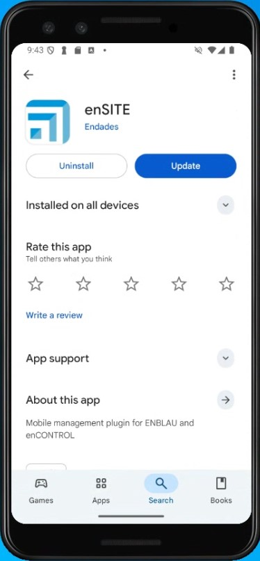
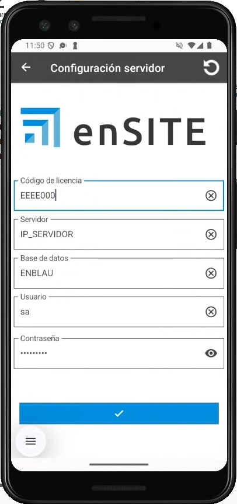
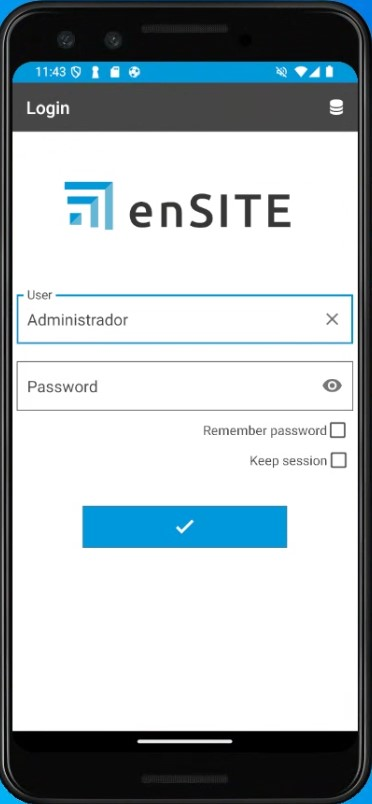
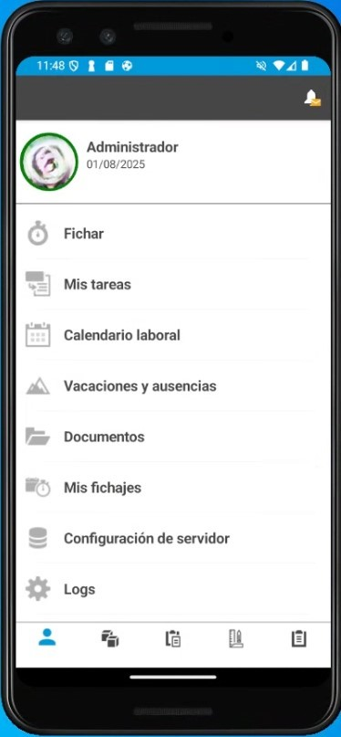

# Requisiti di installazione enSITE

## 1. Requisiti per la configurazione dell’App enSITE

Prima di procedere con l’installazione e la configurazione di enSITE, è necessario effettuare alcune configurazioni preliminari.

### 1.1. Requisiti minimi

I requisiti minimi per installare enSITE su smartphone o tablet dipendono dalla piattaforma e sono determinati da **Google Play Store su Android** e da **App Store su iOS (Attualmente non disponibile)**.

| Requisito | Android (Play Store) | iOS (App Store) |
|----------|----------------------|-----------------|
| **Versione minima del sistema** | Android 15 (API 35); si consiglia comunque l’uso delle versioni più recenti | iOS 16 (Apple richiede che nuove app e aggiornamenti supportino le ultime 3 versioni) |
| **CPU / Architettura** | ARM 64 bit (arm64-v8a); CPU multi-core sufficiente per app standard | Tutti gli iPhone/iPad recenti utilizzano ARM 64 bit |
| **RAM minima** | 3 GB minimi | 3 GB minimi; Apple non lo verifica esplicitamente, dipende dalla versione iOS e dal modello |
| **Spazio libero** | 200 MB minimi per l’installazione | 200 MB minimi per l’installazione |
| **Schermo / risoluzione** | ≥720p consigliata; compatibile con diverse dimensioni (smartphone e tablet) | Tutti i dispositivi compatibili con iOS 16 o superiore |
| **GPU / grafica** | Integrata, compatibile con OpenGL ES o Vulkan | Integrata nel SoC Apple; tutti compatibili con iOS 16 |
| **Connettività** | Wi-Fi / Dati mobili; Bluetooth, GPS | Wi-Fi / Dati mobili; Bluetooth, GPS |
| **Permessi / politiche** | Politiche di privacy se vengono gestiti dati; permessi minimi; conformità Google Play | Politiche di privacy; conformità alle App Store Review Guidelines; permessi giustificati |
| **Aggiornamenti** | Dipende da Google Play e dalla compatibilità dichiarata | Apple richiede compatibilità con le versioni più recenti; se il dispositivo non aggiorna iOS, non riceverà nuove versioni |

> 💡 **Osservazioni:**

1. **Android:** anche se l’hardware è sufficiente, l’aggiornamento dell’app può essere bloccato dai filtri del Play Store.

2. **iOS:** la limitazione principale è la versione di iOS supportata dal dispositivo. Apple gestisce automaticamente la compatibilità.

3. **RAM e spazio di archiviazione:** si tratta di raccomandazioni pratiche; Google non blocca ufficialmente le app in base alla RAM.

### 1.2. Antivirus e Firewall

> Seguire le raccomandazioni della sezione **2. Impostazioni antivirus e firewall** in [Configurazione del Sistema](Configuracion_Sistema.md).

---

## 2. Installazione di enSITE

1. Da un tablet o smartphone con connessione Wi-Fi, accedere al Play Store (Android) o all’App Store (iOS - Attualmente non disponibile), cercare enSITE e scaricare l’app.

    

2. Aprire enSITE e inserire le seguenti informazioni:

    - Codice di licenza (fornito da Endades)
    - IP Server (gli stessi in cui è installato ENBLAU sul server)
    - Database (lo stesso in cui è installato ENBLAU sul server)
    - Utente – **sa** (Autenticazione SQL Server)
    - Password – **Stessa password di connessione al database di ENBLAU** (Autenticazione SQL Server)

    

   - Login **utente** e **password** (gli stessi utilizzati in ENBLAU)

    

    

---

> ℹ️ **Nota:** Per maggiori informazioni su possibili errori nel processo di connessione al server da enSITE, seguire il link: [Possibili errori enSITE](Posibles_Errores.md/#15-error-de-conexion-al-servidor-desde-ensite)

---

> ⚠️ **Importante:** È obbligatorio utilizzare almeno **SQL Server 2022** per garantire la compatibilità con le future versioni di ENBLAU ed enSITE.
