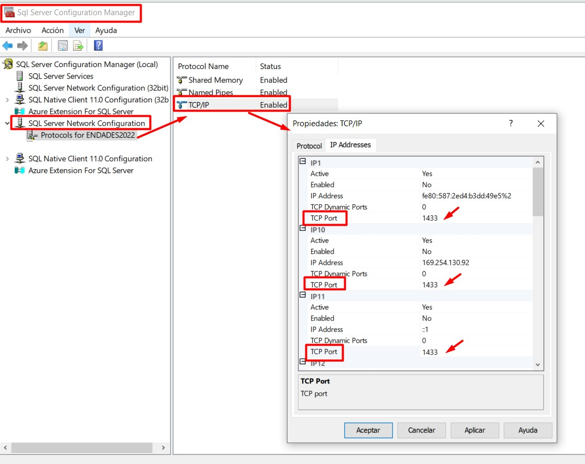
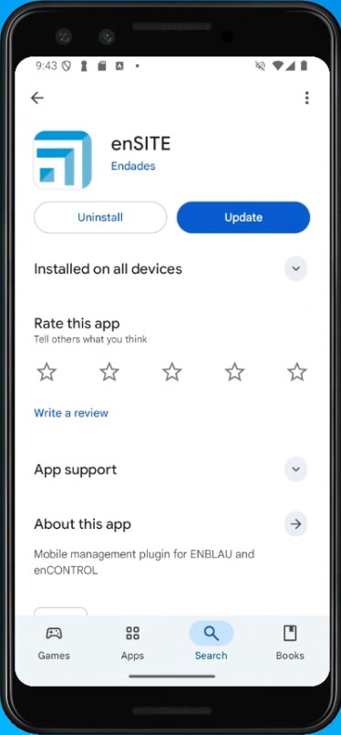
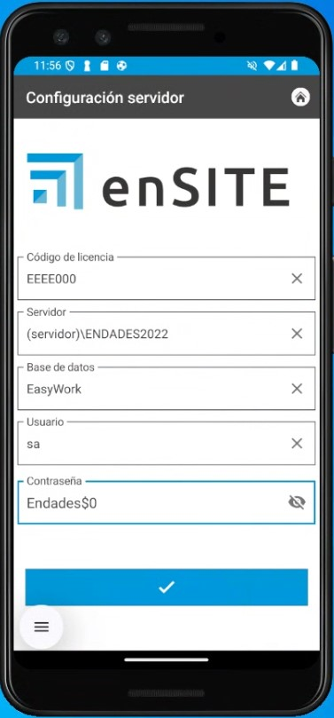
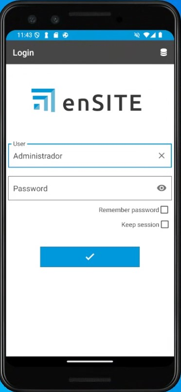
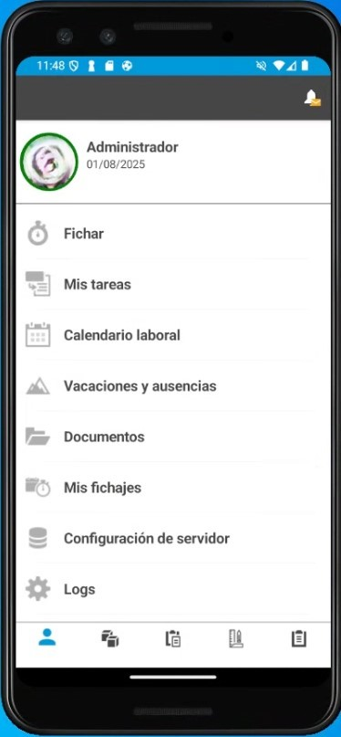

# Requisitos de instalação do enSITE

## 1. Requisitos para a configuração da App enSITE

Antes de proceder à instalação e configuração do enSITE, é necessário realizar algumas configurações prévias.

### 1.1. Requisitos mínimos

Os requisitos mínimos para instalar o enSITE num telemóvel ou tablet dependem da plataforma e são definidos pela **Google Play Store no Android** e pela **App Store no iOS (Atualmente indisponível)**.

| Requisito | Android (Play Store) | iOS (App Store) |
|-----------|----------------------|-----------------|
| **Versão mínima do sistema** | Android 15 (API 35); recomenda-se a utilização das versões mais recentes | iOS 16 (a Apple exige que novas apps e atualizações suportem as últimas 3 versões) |
| **CPU / Arquitetura** | ARM 64 bits (arm64-v8a); CPU multi-core suficiente para apps padrão | Todos os iPhones/iPads recentes utilizam ARM 64 bits |
| **RAM mínima** | 3 GB mínimo | 3 GB mínimo; a Apple não verifica explicitamente, depende da versão do iOS e do modelo |
| **Armazenamento livre** | 200 MB mínimo para instalação | 200 MB mínimo para instalação |
| **Ecrã / resolução** | ≥720p recomendada; compatível com vários tamanhos (telemóvel e tablet) | Todos os dispositivos compatíveis com iOS 16 ou superior |
| **GPU / gráficos** | Integrada, compatível com OpenGL ES ou Vulkan | Integrada no SoC da Apple; todos compatíveis com iOS 16 |
| **Conectividade** | Wi-Fi / Dados móveis; Bluetooth, GPS | Wi-Fi / Dados móveis; Bluetooth, GPS |
| **Permissões / políticas** | Políticas de privacidade se houver dados; uso mínimo de permissões; conformidade com a Google Play | Políticas de privacidade; conformidade com as App Store Review Guidelines; permissões justificadas |
| **Atualizações** | Depende da Google Play e da compatibilidade declarada | A Apple exige compatibilidade com as versões mais recentes; se o dispositivo não atualizar o iOS, não receberá novas versões |

> 💡 **Observações:**

1. **Android:** mesmo que o hardware seja suficiente, a atualização da app pode ser bloqueada por filtros da Play Store.

2. **iOS:** a principal limitação é a versão do iOS suportada pelo dispositivo. A Apple controla automaticamente a compatibilidade.

3. **RAM e armazenamento:** são recomendações práticas; a Google não bloqueia oficialmente apps com base na RAM.

### 1.2. Antivírus e Firewall

> Seguir as recomendações da secção **2. Ajustes de antivírus e firewall** em [Configuração do Sistema](Configuracion_Sistema.md).

### 1.3. Configuração TCP/IP

No servidor, certifique-se de que as **portas utilizadas pelo SQL Server estão habilitadas**, incluindo:

- **1433/TCP** (porta padrão do SQL Server). Verificar e configurar em **SQL Server Configuration Manager**:

  - Aceder a **SQL Server Network Configuration → Protocols for ENDADES2022**.
  - Em **Propriedades do TCP/IP → IP Addresses**, verificar que **todos os IPs** têm a **TCP Port** configurada como **1433** e que as **TCP Dynamic Ports** estão definidas como **0**.

  

---

## 2. Instalação do enSITE

### 2.1. Baixar a App enSITE

- A partir de um tablet ou telemóvel com ligação WiFi, aceder à Play Store (Android) / App Store (iOS – Atualmente não disponível) e procurar e instalar a app enSITE.

  

---

### 2.2. Configuração do Servidor enSITE

Abrir o enSITE e adicionar as seguintes informações para configurar o servidor na aplicação:

- Código de licença (fornecido pela Endades)

- IP do servidor (o mesmo onde o ENBLAU está instalado no servidor)

- Base de dados (a mesma onde o ENBLAU está instalada no servidor)

- Utilizador – **sa** (Autenticação SQL Server)

- Palavra-passe – **A mesma palavra-passe de ligação à base de dados do ENBLAU** (Autenticação SQL Server)

  

---

### 2.3. Login enSITE

- Iniciar sessão com **utilizador** e **palavra-passe** (as mesmas credenciais utilizadas no ENBLAU)

  

  

---

> ℹ️ **Nota:** Para mais informações sobre possíveis erros no processo de ligação ao servidor a partir do enSITE, seguir o link: [Possíveis erros enSITE](Posibles_Errores.md/#15-error-de-conexion-al-servidor-desde-ensite)

---

> ⚠️ **Importante:** É obrigatório utilizar, no mínimo, o **SQL Server 2022** para garantir a compatibilidade com futuras versões do ENBLAU e do enSITE.
